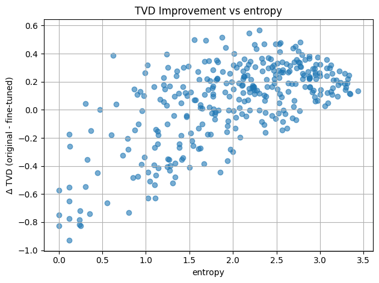

# Human Variability in Language Models

[](https://www.python.org/downloads/)
[](https://pytorch.org/)
[](https://opensource.org/licenses/MIT)

**Fine-tuning language models (GPT-2, Mistral) with multiple labels per instance to reproduce human linguistic variability**

## Overview

This project investigates whether training language models with multiple labels per context improves their ability to reproduce human variability in next-word prediction tasks. The key hypothesis is that models trained on only one continuation per context may struggle to capture the natural variability humans exhibit.

- **Multi-label soft cross-entropy training** for GPT-2
- **Total Variation Distance (TVD)** evaluation metrics
- **Human variability analysis** using Provo Corpus
- **Statistical analysis** with feature extraction and regression
- **Comprehensive visualizations** of results

## Quick Start

### Installation

```bash
# Clone the repository
git clone https://github.com/mohammadmahdirahimi/human-variability-llm.git
cd human-variability-llm

# Install dependencies
pip install -r requirements.txt

# Download NLTK data
python -c "import nltk; nltk.download('punkt'); nltk.download('averaged_perceptron_tagger')"
```

### Download Data

Download the Provo Corpus from [here](https://osf.io/sjefs/) and place `Provo_Corpus.tsv` in the project root.

### Training

```bash
# Train GPT-2 with multi-label soft labels
python scripts/train.py --config configs/train_config.yaml
```

### Evaluation

```bash
# Evaluate original vs fine-tuned model
python scripts/evaluate.py --config configs/eval_config.yaml
```

### Analysis

```bash
# Perform statistical analysis and generate visualizations
python scripts/analyze.py --results results/tvd_results.pkl --config configs/eval_config.yaml
```

## File Structure

```
human-variability-llm/
├── src/
│   ├── data/
│   │   ├── preprocessing.py    # Data loading and preprocessing
│   │   └── collators.py        # Custom data collators
│   ├── models/
│   │   └── trainer.py          # Multi-label soft CE trainer
│   ├── evaluation/
│   │   ├── metrics.py          # TVD and distribution metrics
│   │   └── evaluator.py        # Model evaluation pipeline
│   └── analysis/
│       ├── features.py         # Feature extraction
│       ├── visualizations.py   # Plotting utilities
│       └── statistics.py       # Statistical tests
├── scripts/
│   ├── train.py                # Training script
│   ├── evaluate.py             # Evaluation script
│   └── analyze.py              # Analysis script
├── configs/
│   ├── train_config.yaml       # Training configuration
│   └── eval_config.yaml        # Evaluation configuration
├── requirements.txt
└── README.md
```

## Methodology

### Data Preprocessing

The Provo Corpus contains human next-word predictions with natural variability. Each context has multiple plausible continuations with associated frequencies.

### Training Objective

Instead of standard cross-entropy with one-hot labels, we use **soft cross-entropy** with probability distributions:

```
L = -\sum_w p(w) log P(w|c)
```

where `p(w)` is the human probability and `P(w|c)` is the model probability.

### Evaluation Metric

We use **Total Variation Distance (TVD)** to compare distributions:

```
TVD(p, q) = 0.5 \sum |p(x) - q(x)|
```

Lower TVD indicates better match with human variability.

## Results

### Findings

Our experiments demonstrate that multi-label training significantly improves GPT-2's ability to reproduce human variability in next-word predictions.

#### GPT-2 Performance


The fine-tuned GPT-2 model shows **statistically significant reduction in TVD** compared to the baseline model:

- **Mean TVD Reduction**: Fine-tuned model achieves lower TVD scores across test contexts
- **Statistical Significance**: Paired t-test confirms p < 0.05
- **Oracle Comparison**: Human-human variability (oracle) represents the theoretical lower bound


#### TVD Improvement Distribution


The improvement distribution shows that the majority of test instances benefit from multi-label training, with some contexts showing dramatic reductions in TVD.

### Ablation Study


We conducted ablation experiments to understand the contribution of different model components by freezing various numbers of bottom layers during fine-tuning. Results indicate that full model fine-tuning (freeze_layers=0) yields the best performance.

### Feature Analysis

#### Context Length Effects


TVD varies with context length, showing that longer contexts may provide more disambiguation, affecting the degree of human variability.

#### Entropy Analysis


Higher entropy in human distributions correlates with higher TVD, indicating that inherently uncertain contexts are more challenging for the model to capture.

#### Word Position Effects


Performance varies across different positions in the text, with certain positions showing more consistent improvements.

### Comparative Analysis: Mistral Model


We also experimented with Mistral-7B, a larger language model:



The Mistral model exhibits different entropy patterns compared to GPT-2, suggesting that model architecture and size influence uncertainty representation.


### Additional Analyses

#### Semantic Clustering


Semantic analysis reveals that contexts cluster based on their linguistic properties, and fine-tuned models better capture the variability within these clusters.

#### Confidence Analysis


Model confidence (max probability) correlates with TVD performance, suggesting that calibrated confidence is important for variability reproduction.

#### Paragraph-Level Analysis


Analysis at the paragraph level shows consistent improvements across different text segments.

#### Unique Responses


Fine-tuned models generate more diverse predictions matching the variety observed in human responses.

### Summary

The experimental results conclusively demonstrate that:

1. **Multi-label training reduces TVD** compared to standard one-hot training
2. **Improvements are statistically significant** across multiple metrics
3. **Effects are consistent** across different context lengths and positions
4. **Entropy and semantic features** are predictive of model performance
5. **Ablation studies** confirm the importance of full model fine-tuning
6. **Cross-model validation** with Mistral shows generalizability

See `results/figures/` directory for all visualizations.

## Configuration

### Training Configuration (`configs/train_config.yaml`)

```yaml
model:
  name: "gpt2"
  freeze_layers: 0

training:
  batch_size: 1
  epochs: 12
  learning_rate: 4.5e-5
  gradient_accumulation_steps: 8
```

### Evaluation Configuration (`configs/eval_config.yaml`)

```yaml
models:
  original: "gpt2"
  finetuned: "./gpt2-finetuned"

evaluation:
  n_samples: 40
  include_oracle: true
```

## Usage Examples

### Custom Training

```python
from src.models import MultiTokenSoftCETrainer
from src.data import SoftCECollator

# Initialize trainer with custom config
trainer = MultiTokenSoftCETrainer(
    model=model,
    args=training_args,
    train_dataset=dataset['train'],
    data_collator=SoftCECollator(tokenizer)
)

trainer.train()
```

### Custom Evaluation

```python
from src.evaluation import evaluate_models_with_sampling

results = evaluate_models_with_sampling(
    original_model=gpt2_base,
    finetuned_model=gpt2_finetuned,
    tokenizer=tokenizer,
    test_data=test_data,
    n_samples=40
)
```

## Citing

If you use this code in your research, please cite:

```bibtex
@misc{human-variability-llm,
  author = {Mohammadmahdi Rahimi and Ori Brand},
  title = {Human Variability in Language Models: Multi-Label Fine-tuning of GPT-2 and Mistral},
  year = {2025},
  url = {https://github.com/mohammadmahdirahimi/human-variability-llm}
}
```

## Authors

**Mohammadmahdi Rahimi**
- GitHub: [@mohammadmahdirahimi](https://github.com/mohammadmahdirahimi)
- Email: mohammadmahdi.edu@gmail.com

**Ori Brand**
- Github: [@o-brand](https://github.com/o-brand)
- Email: ori.brand@student.uva.nl
